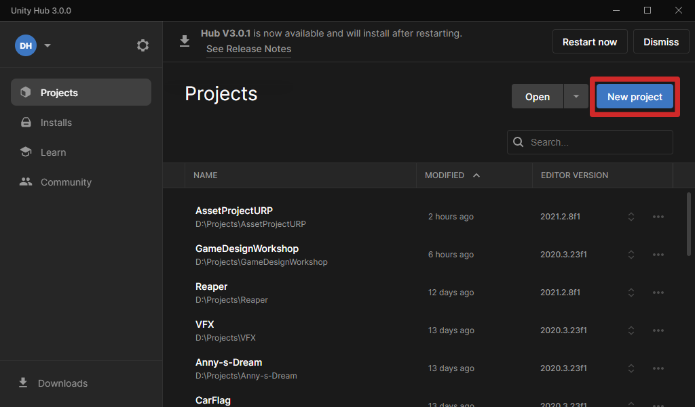
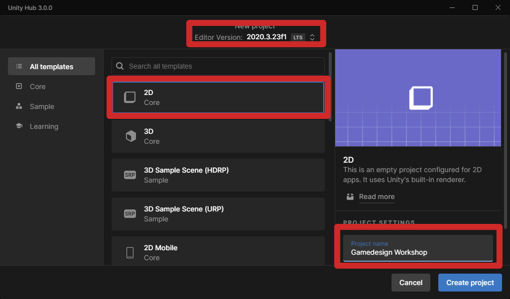
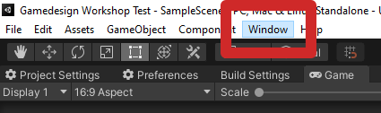
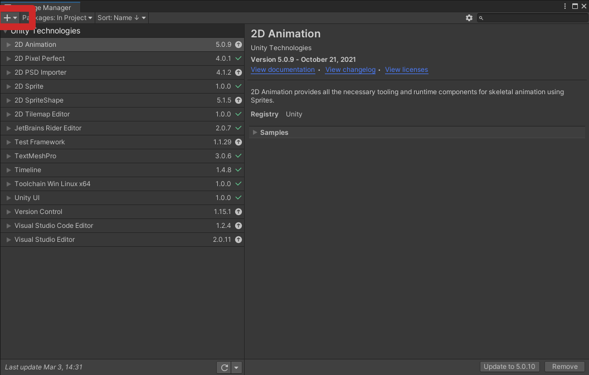
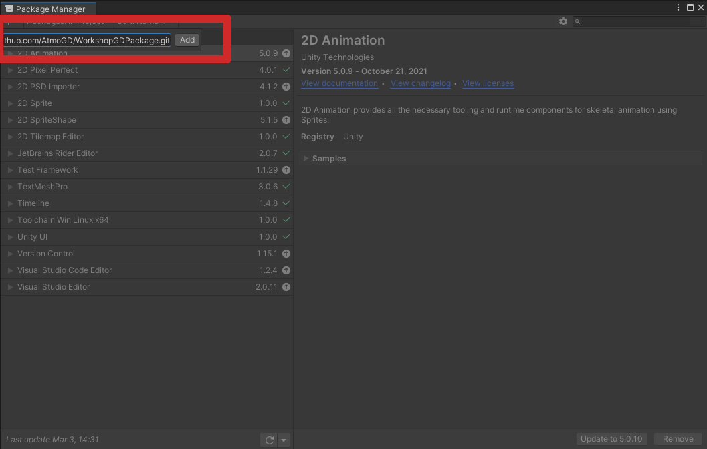
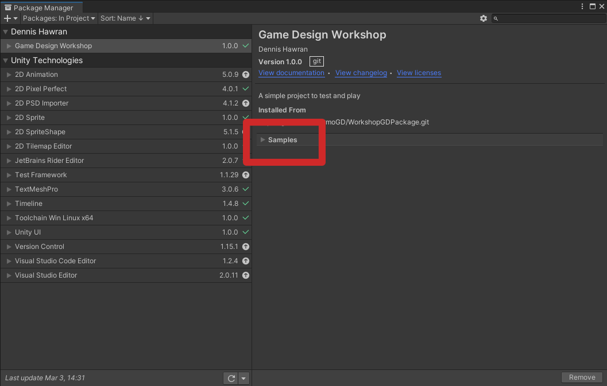
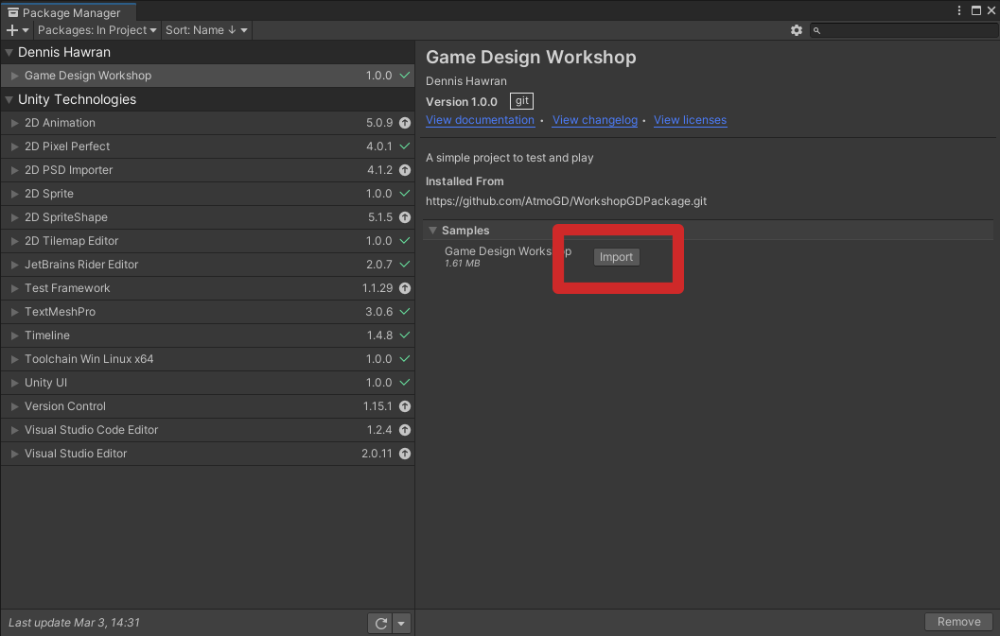
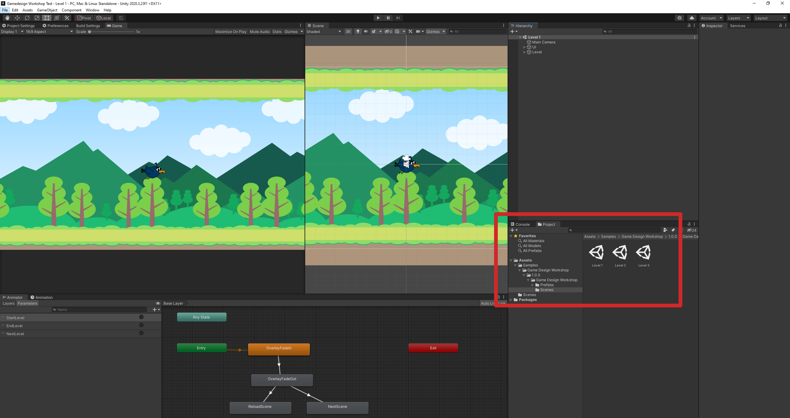

# Gamedesign Workshop am 10.03.2022 & 17.03.2022

## Installation

Unity Version: **2020.3.30f1**

Zusätzliche packages werden **keine** gebraucht.

### Projekt erstellen

Nach dem das neue Fenster erschienen ist kontrollieren ob die **Version** richtig ist, das **Template** auf **2D Core** gestellt ist und der **Project name** eingegeben wurde.

Sobald das Projekt fertig erstellt wurde findet man unter dem Reiter **Window** das Feld **Package Manager**

Im Package Manager oben links auf das **plus** Symbol klicken.

Es erscheint ein Eingabefeld. Dort folgendes eintippen: **https://github.com/AtmoGD/WorkshopGDPackage.git**

Sobald das Package fertig ist ist dort ein Reiter mit **Samples**. Dieses aufklappen und auf **Import** klicken

Wenn alles funktioniert hat sollte in der **Hierarchie** folgende Ordnerstruktur zu sehen sein. Unter **Scenes** können die 3 level jetzt auch gespielt werden.

**Achtung:** Wenn das Spiel gespielt wird ist es noch nciht möglich den Button **Nächstes Level** zu benutzten. Klickt man darauf hängt sich das Spiel auf. Das mache ich dann fertig wenn ich da bin.

